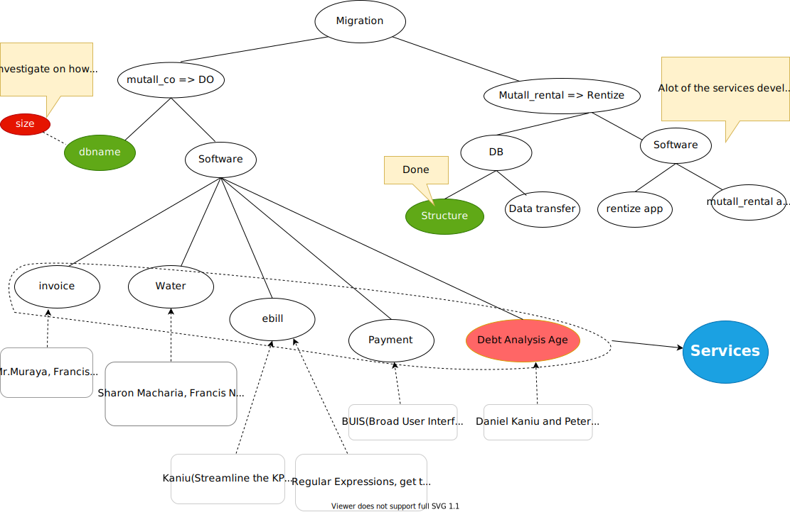

# RENTIZE
## Objectives

- The rentize system has two main users, the **landlord** and the **tenant**. It allows for management of
    mutall enterprise.

    | User     | Long-term Objectives                                                                                                                                                                                           |
    | -------- | -------------------------------------------------------------------------------------------------------------------------------------------------------------------------------------------------------------- |
    | tenant   | 1. They should be able to view the monthly invoices (payments), and the reports `should be accurate`. 2. The client must be able to interrogate the system and view the historical statement of their account. |
    | landlord | 1. KRA Tax Compliance. Using the accounting program, the landlord's tax complaince to KRA should become easier                                                                                                 |

- Upgrade mutall_rental to rentize,i.e., have the accounting bit in mutall_rental separated to
  - rentize.
  - accounting module.
- `Other Objectives`.  
    - Change the database according to the specifications.
     - [ ] Remove the accounting table. ` It is part of the Accounting model`,
     - [ ] Change the `client` entity/table to `tenant`.
# Agenda
- The migration module helps in the visualization of the movement of applications and databases from `Mutall.co.ke` to `Digital Ocean`.
  During the migration, the system is set to change its operability style but retain its operability functions.
  The migration module will help do that, and it is visualized below.
  .

## Monthly INVOICING service
1.  [ ] `Errors`. Have a look at the errors generated from the movement of the 
                water bill system to **digital_ocean**.
        `Mr.Muraya`.
    - [ ] Have a local version of the mutall_co database and resolve the 
              issues locally, and once they are done, fix the 
                same issues online.`Nyakundi`

2. [ ] `Report Familiarity`.To make your work easier,familiarize yourself with the reports. 
    
` Camilus and James`.
3. [ ] `Training`.Train `Joel` on how to use the mutall rental system for reporting
            and he should report on the reporting requirements that he needs, 
            so that we can develop such a reporting mechanism.`Camillus` or anyone.

## WATER Billing Service
1. [ ] Fix the Water readings and ebill on digital ocean.
2. [ ] Look at the water reading modules on mutall.co.ke. `Nyakundi`.
3. [ ] `Data Collection`. Collect the Water bill data physically and make sure it is sent to the server.
        `Sharon,Nyakundi,James`.

## ELECTRICITY Billing Service
1.  [ ] Fix the ebill references once the modules are on Digital Ocean `Kaniu`.

3.  [ ] Get the previous message format and check against the new format to 
        modify the regular experssions to facilitate resending of KPLC bills to 
        the clients.`Peter`.
4.  [ ] Proceed to extract the necessary fields from the text message using
        regular expressions.`Peter`.

## PAYMENT Services
1. [ ] Design an interface for capturing the credit and debit from the clients
2. [ ] Modify the current payment template to include details from mutall rental.

## Debt Age Analysis
1. [ ] Have the current mutall_co database on access, and use it to perform debt
       age analysis.`Peter,Kaniu, and Camillus`.

## Data Transfer from mutall_rental to Rentize
  
1. [ ] `Backup`. Create a backup system that include a local backup for all
                databases and the files. **The system should facilitate backups
                that go further than 5 months**. 
         `Peter`
2. [ ] Study how other people automate backups with respect to both the local and the web server. `Peter`.
3. [ ] Do manual database backups from mutall_co to D_O for 3 sessions.
4. [ ] Develop a script after completing the process.
5. [ ] Run the script for at least 2 sesssions
6. [ ] Schedule the script to make the backups.

## Development of a new rental system Rentize
1. [ ] Have `mutall_rental` and `rentize` setup and running in your local machine.
        `James`.

## Others Assignments
1. [ ] `Documentation`.Think of a system for accessing markdown files. Say for example, on the server, have a folder under the application
        such as `http://206.189.207.206/tracker/mdview.js` from there, you can call the file from any application, i.e.,
        `mdview.js?filename=kentionary/doc/fs.md`. 
        `Peter`.

2. [ ] `Restructuring code`. After the reference to the server are resolved, restructure the code to have rentize as part of the library
        under, `rentize/v/code`.`guided by Mr.Muraya` using the `MIGRATION MODULE`
    - Transfer of data between databases and transfer of databases.
    `ACCOUNTING MODULE`
     - This module will enable the management of financial records.
        - [ ] Refresh on the basics of Accounting.

`Accounting Module`.
  
3. [ ] Presentation on how to capture transactions within a ledger. `Camillus`.

4. [ ] Model Accounting charts in `tracker` and `rentize` to show us which account to debit and which accounts to credit.
    - Refer to the dealer model for further information.
 
# Completed Assignments

- [x] `Database Migration`.load mutall_rental from the server `mutall.co.ke` to digitial ocean `206.189.207.206`.
`James and Peter`.
- [x] `Database`. Rearrange the mutall_rental system to have a view similar to the mutall_rentize to view the similar
  entities and associate them.
- [x] .`Code`. Migrate the code to the mutall_rental code to `digital_ocean` and resolve the references to the server.
`Nyakundi`.
- [x] Learn how to do a markup with a Table of Contents `Sharon`.
- [x] Pursue KRA reporting (Accounting Module).`Camillus`.
- [x] `Database Migration` . Conceive and integrate a migration module into the
        time table.
        `Mr.Muraya`.
- [x] Demonstrate on how BUIS is used to send messages.`Camillus`.
- [x] Show Kaniu how the KPLC bills are collected and Sent.`Camillus`.
- [x] Train `James` on how to use the mutall_rental system.`Camillus`.
- [x] You should be able to see an error and know where to go.
- [x] You should be able to generate the reports and supply them to the tenants.